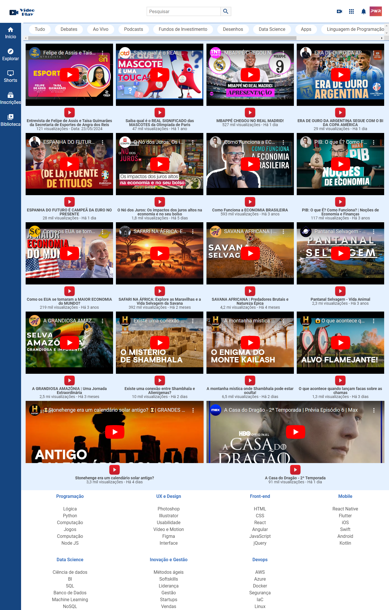

<div align="center">

</div>

## ✳️ Descrição do projeto

VideoPlay é um projeto de interface web para visualização de vídeos do YouTube, organizados por categorias e temas variados.
O objetivo desse projeto foi criar uma página utilizando **apenas** HTML5 e CSS3 para a renderização, tanto no desktop, quanto em tablets e em smartphones.
Para cada disposivo a tela é renderizada de um jeito devido ao seu layout responsivo.

## 🌎 Link do site

https://video-play-sand.vercel.app/

## 💻 Tecnologias utilizadas

Projeto foi desenvolvido utilizando as seguintes tecnologias:

- Linguagem HTML e CSS.

## ▶️ Como executar o projeto

- Clonar o repositório

```sh
https://github.com/EduardoPSRodrigues/VideoPlay.git
```

- Instalar a extensão Live Server - v5.7.9 de Ritwick Dey

- Depois no canto inferior direito selecionar Go Live para iniciar o servidor

|                                                               Autor                                                                |                                      GitHub                                       |                                Linkedin                                |
| :--------------------------------------------------------------------------------------------------------------------------------: | :-------------------------------------------------------------------------------: | :--------------------------------------------------------------------: |
|  | Eduardo Rodrigues :: [@EduardoPSRodrigues](https://github.com/EduardoPSRodrigues) | [Meu Perfil](https://www.linkedin.com/in/eduardo-rodrigues-a1a0792a4/) |
